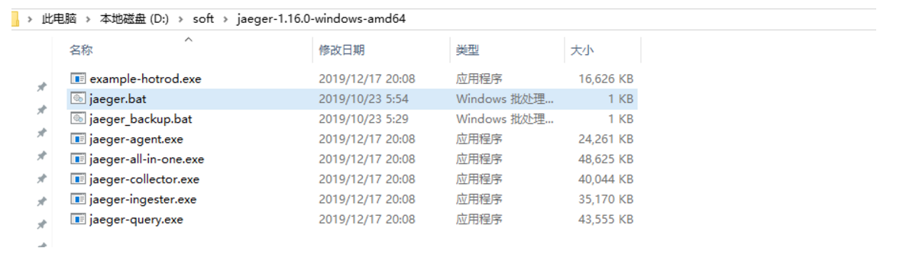
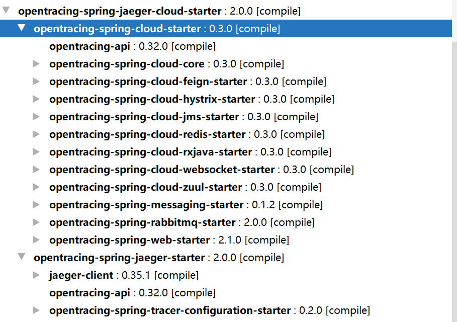
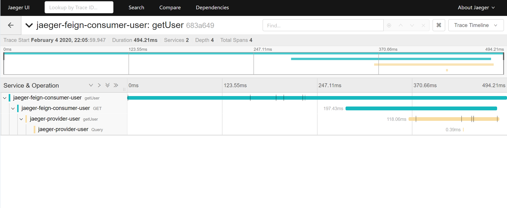

# Spring Cloud项目接入Jaeger


# 简介
  随着分布式系统中调用关系的复杂化加大，调用链系统越来越迫切需要了，在Spring Cloud 以及 google dagger 论文发表之后，来了很多调用链中间价，如： skywalking 等，今天我分享下jaeger项目，jaeger是 cncf机构（Cloud Native Computing Foundation，https://www.cncf.io/）孵化出来的，以后业类其他的框架肯定也是向jaeger靠拢。好了，下面步入正题。


# jaeger 服务端安装

官网： https://www.jaegertracing.io/docs/1.16/getting-started/

我是windows环境，所以演示windows环境，其他环境大体类似。下载，解压：



新建 jaeger.bat 文件，内容为：  jaeger-all-in-one ，每次启动双击 jaeger.bat 即可，浏览器打开后台地址，http://localhost:16686/search 


# 本地代码


pom.xml 文件引入： 

```xml
        <opentracing-okhttp3.version>2.0.1</opentracing-okhttp3.version>
        <opentracing-spring-jaeger-cloud-starter.version>2.0.0</opentracing-spring-jaeger-cloud-starter.version>


        <dependency>
            <groupId>io.opentracing.contrib</groupId>
            <artifactId>opentracing-spring-jaeger-cloud-starter</artifactId>
            <version>${opentracing-spring-jaeger-cloud-starter.version}</version>
            <exclusions>
                <!--调用链监控无法支持TDDL，用到TDDL的应用，需把jdbc监控排除掉，否则会报错：Caused by: java.lang.IllegalArgumentException: Invalid JDBC URL. Expected to find the database type after the first ':'. URL: null-->
                <exclusion>
                    <groupId>io.opentracing.contrib</groupId>
                    <artifactId>opentracing-spring-cloud-jdbc-starter</artifactId>
                </exclusion>
                <exclusion>
                    <groupId>io.opentracing.contrib</groupId>
                    <artifactId>opentracing-spring-cloud-mongo-starter</artifactId>
                </exclusion>
                <exclusion>
                    <groupId>io.opentracing.contrib</groupId>
                    <artifactId>opentracing-spring-cloud-reactor-starter</artifactId>
                </exclusion>
            </exclusions>
        </dependency>

        <!--RpcHandler 使用了 OkHttp-->
        <dependency>
            <groupId>io.opentracing.contrib</groupId>
            <artifactId>opentracing-okhttp3</artifactId>
            <version>${opentracing-okhttp3.version}</version>
        </dependency>


其中， opentracing-spring-cloud-starter 官方包含：

    <dependency>
      <groupId>${project.groupId}</groupId>
      <artifactId>opentracing-spring-cloud-core</artifactId>
    </dependency>
    <dependency>
      <groupId>io.opentracing.contrib</groupId>
      <artifactId>opentracing-spring-web-starter</artifactId>
      <version>${version.io.opentracing.contrib-opentracing-spring-web}</version>
    </dependency>
    <dependency>
      <groupId>io.opentracing.contrib</groupId>
      <artifactId>opentracing-spring-messaging-starter</artifactId>
    </dependency>
    <dependency>
      <groupId>${project.groupId}</groupId>
      <artifactId>opentracing-spring-rabbitmq-starter</artifactId>
    </dependency>
    <dependency>
      <groupId>${project.groupId}</groupId>
      <artifactId>opentracing-spring-cloud-jdbc-starter</artifactId>
    </dependency>
    <dependency>
      <groupId>${project.groupId}</groupId>
      <artifactId>opentracing-spring-cloud-jms-starter</artifactId>
    </dependency>
    <dependency>
      <groupId>${project.groupId}</groupId>
      <artifactId>opentracing-spring-cloud-feign-starter</artifactId>
    </dependency>
    <dependency>
      <groupId>${project.groupId}</groupId>
      <artifactId>opentracing-spring-cloud-hystrix-starter</artifactId>
    </dependency>
    <dependency>
      <groupId>${project.groupId}</groupId>
      <artifactId>opentracing-spring-cloud-rxjava-starter</artifactId>
    </dependency>
    <dependency>
      <groupId>${project.groupId}</groupId>
      <artifactId>opentracing-spring-cloud-mongo-starter</artifactId>
    </dependency>
    <dependency>
      <groupId>${project.groupId}</groupId>
      <artifactId>opentracing-spring-cloud-websocket-starter</artifactId>
    </dependency>
    <dependency>
      <groupId>${project.groupId}</groupId>
      <artifactId>opentracing-spring-cloud-zuul-starter</artifactId>
    </dependency>
    
```


引入：opentracing-spring-jaeger-cloud-starter 依赖，他就引入了一系列和Spring Cloud组件其他的依赖了。同时因为我用到了ok-http，所以加上了 opentracing-okhttp3 依赖。 





主代码例子： 

不需要任何代码，只需yml配置如下： 

```yaml
opentracing:
  jaeger:
    enabled: true  # 是否启用 jaeger
    udpSender:   # 使用udp发送
      host: 127.0.0.1
      port: 6831
      max-packet-size: 65000
    probabilisticSampler:  #采样率配置
      samplingRate: 1.0
    enable-b3-propagation: true
    expandExceptionLogs: true
    log-spans: false  # 是否打印日志的span信息，不用打印
```


测试图： 




具体代码： https://gitee.com/xiaomaoguai/Spring-Cloud-Learn/tree/master/jaeger-micro-spring-cloud


#  源码扩展

默认tracing组件，看起来实现没有像skywalking那样通过agent的方式的轻便以及对应用的无侵入性。当然jaeger也提供了类似agent方式来搜集跨度信息的，只不过jaeger目前支持的组件还比较少，因此很多情况需要自己来扩展插件了。所以简单看下jaeger源码： 


首先根据配置，找到jaeger代码入口：  JaegerAutoConfiguration  ,可以看到所有的配置都在： JaegerConfigurationProperties 里面了。


```java
@Configuration
@ConditionalOnClass(io.jaegertracing.internal.JaegerTracer.class)
@ConditionalOnMissingBean(io.opentracing.Tracer.class)
@ConditionalOnProperty(value = "opentracing.jaeger.enabled", havingValue = "true", matchIfMissing = true)
@AutoConfigureBefore(io.opentracing.contrib.spring.tracer.configuration.TracerAutoConfiguration.class)
@EnableConfigurationProperties(JaegerConfigurationProperties.class)
public class JaegerAutoConfiguration {

  @Autowired(required = false)
  private List<TracerBuilderCustomizer> tracerCustomizers = Collections.emptyList();

  @Bean
  public io.opentracing.Tracer tracer(Sampler sampler,
                                      Reporter reporter,
                                      Metrics metrics,
                                      JaegerConfigurationProperties properties) {

    final JaegerTracer.Builder builder =
        new JaegerTracer.Builder(properties.getServiceName())
            .withReporter(reporter)
            .withSampler(sampler)
            .withTags(properties.determineTags())
            .withMetrics(metrics);

    tracerCustomizers.forEach(c -> c.customize(builder));

    return builder.build();
  }
```


## 日志显示trace 和 span

需要配置 自定义 TracerBuilderCustomizer ，可以参见代码， WrappedThreadLocalScopeManager


## 搜集的日志信息是没有对关键字进行脱敏的

可以暴露接口出来，搜集信息的时候对搜集信息进行脱敏处理。


## jaeger动态启用禁用等 

jaeger虽然提供了 采样率，但是我们第一次集成jaeger时，可能在某些情况需要禁用jaeger，暴露开关标识给到外面，在自定义搜集入口判断开关，减少采样率。