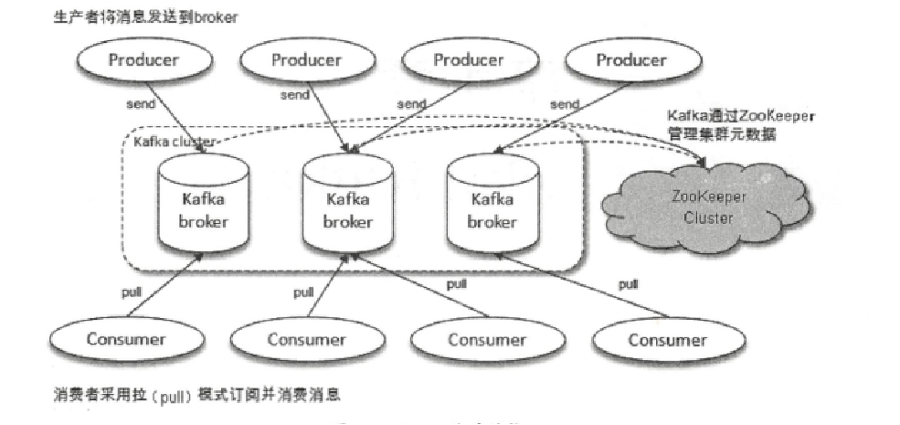
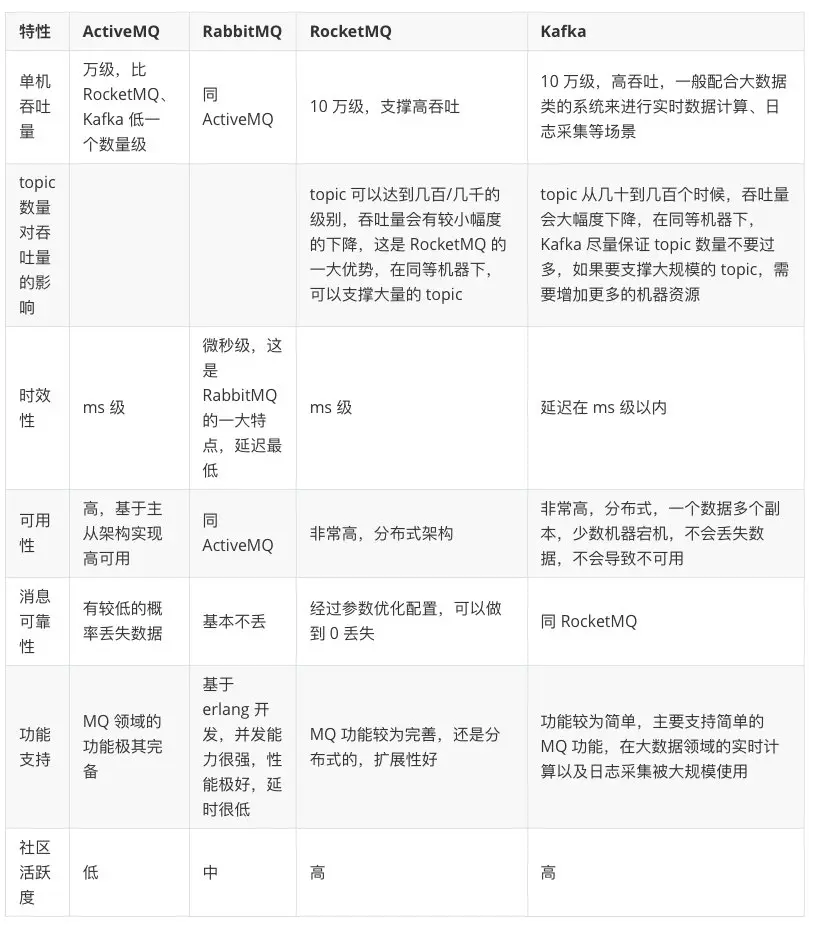

## 一.概述

### 1.1 kafka简介

 Kafka起初由LinkedIn公司采用Scala语言开发的一个多分区、多副本且基于Zookeepeer协调的分布式消息系统，现已被捐献给Apache基金会。目前kafka已经定位为一个[分布式流式处理平台](http://kafka.apache.org/intro.html)。
 

>- 消息系统：系统解耦、冗余存储、流量削峰、消息顺序性、回溯消息。
>                                                                   
>- 存储系统：消息持久化到磁盘，多副本机制。
>
>- 流处理平台：kafka-stream，提供完整的流处理类库，如：窗口、连接、变换和聚合等。

### 1.2 kafka使用场景

>使用场景：
>
>（1）消息系统。Kafka作为一款优秀的消息系统，具有高吞吐量、内置的分区、备份冗余分布式等特点，为大规模消息处理提供了一种很好的解决方案。
>
>（2）应用监控。利用Kafka采集应用程序和服务器健康相关的指标，如CPU占用率、IO、内存、连接数、TPS、QPS等，然后将指标信息进行处理，从而构建一个具有监控仪表盘、曲线图等可视化监控系统。例如，很多公司采用Kafka与ELK（ElasticSearch、Logstash和Kibana）整合构建应用服务监控系统。
>
>（3）网站用户行为追踪。为了更好地了解用户行为、操作习惯，改善用户体验，进而对产品升级改进，将用户操作轨迹、内容等信息发送到Kafka集群上，通过Hadoop、Spark或strom等进行数据分析处理，生成相应的统计报告，为推荐系统推荐对象建模提供数据源，进而为每个用户进行个性化推荐。
>
>（4）流处理。需要将已收集的流数据提供给其他流式计算框架进行处理，用Kafka收集流数据是一个不错的选择，而且当前版本的Kafka提供了Kafka Streams支持对流数据的处理。
>
>（5）持久性日志。Kafka可以为外部系统提供一种持久性日志的分布式系统。日志可以在多个节点间进行备份，Kafka为故障节点数据恢复提供了一种重新同步的机制。同时，Kafka很方便与HDFS和Flume进行整合，这样就方便将Kafka采集的数据持久化到其他外部系统。


开普勒使用场景：

>1.binlog=>kafka=>Flink,实时监控:授信、借款、还款；
>
>2.binlog=>kafka=>数据写入ES-》开普勒ops运营统计


## 二. kafka基本架构和几个概念



#### 三个角色：

>1. 生产者：即Producer，向Kafka集群发送消息，在发送消息之前，会对消息进行分类，即Topic。
>
>2. 消费者：即Consumer，消费者通过与kafka集群建立长连接的方式，不断地从集群中拉取消息，然后可以对这些消息进行处理。
>
>3. Broker：kafka集群中的服务器。

#### 两个概念

>1. 主题（topic）： 逻辑上的概念,消息的分类;
>
>2. 分区（partition）：物理上的概念，一个topic可以分为多个partition，每个partition内部是有序的;
>
#### 一个分类 

>分区下副本的分类


>注意：
>
>1.分区会有单点故障问题，所以我们会为每个分区设置副本数;
>
>2.分区的编号是从0开始的(eg:test-topic-0,test-topic-1);;


>副本延伸出的一些概念：
>
>1. leader、follower : 每个分区只有一个Leader副本，负责读和写，follower 副本作为故障转移;
>2. AR  : All Replicas
>3. ISR : In-Sync-Replicas , 同步条件：10S内有请求最新数据的请求
>4. OSR : Out-of-Sync-Replicas
>5. LSO : Log Start Offset
>6. LEO : Log End Offset
>7. HW :  HighWaterMark
>8. LW :  LowWaterMark


## 三. kafka生产者

### 3.1 消息写入流程

>谈到kafka的存储，就不得不提到分区，即partitions，创建一个topic时，同时可以指定分区数目，分区数越多，其吞吐量也越大，但是需要的资源也越多，同时也会导致更高的不可用性，kafka在接收到生产者发送的消息之后，会根据均衡策略将消息存储到不同的分区中。


生产者指定分区示意图


在每个分区中，消息以顺序存储，最晚接收的的消息会最后被消费。


>分区的原因：
>
>1. 分布式高扩展；
>2. 可以提高并发；


### 3.2 消息发送过程

>1. 拦截器；
>2. 序列化器；
>3. 分区器；


```
生产者发送代码解析：

org.apache.kafka.clients.producer.KafkaProducer.send(ProducerRecord, Callback);

分区数据结构：
org.apache.kafka.common.PartitionInfo

节点数据结构：
org.apache.kafka.common.Node
```


### 3.3 生产者整体架构：


### 3.4 生产者高可用设计

> 1、生产者写入消息的CallBack机制，保证写入;
>
> 2、配置重试次数，最大化自行处理常见异常(LeaderNotAvailableException、NotControllerException、NetworkException);
>
> 3、消息打包成一个batch在发送;
>
> 4、应答机制，消息写入ack，防止消息丢失;
>
>

#### 2、批量写入


## 四. kafka消费者

### 4.1 kafka消费模型

>#### 1. point-to-point 和 广播
>
>
>#### 2. pull 和 push
>


#### 4.1 分区分配策略

> 1、RangeAssignor
>
> 2、RoundRobinAssignor
>
> 3、StickyAssignor
>
> 4、自定义Assignor


#### 4.2 多线程消费


#### 4.3 消费者高可用设计

### 消费者再均衡

### GroupCoordinator : 
>每个consumer group都会选择一个broker作为自己的coordinator，负责监控这个消费组里的各个消费者的心跳，以及判断是否宕机，然后开启rebalance，
根据内部的一个选择机制，会挑选一个对应的Broker，Kafka会把各个消费组均匀分配给各个Broker作为coordinator来进行管理，consumer group中的每个consumer刚刚启动就会跟选举出来的这个consumer group对应的coordinator所在的broker进行通信，然后由coordinator分配分区给这个consumer来进行消费。coordinator会尽可能均匀的分配分区给各个consumer来消费。

### ConsumerCoordinator : 


## 五. kafka broker

### 5.1、 broker端的几个角色


#### Controller : 
>kafka也是主从式的架构，主节点就叫controller，其余的为从节点，controller是需要和zookeeper进行配合管理整个kafka集群。

> 
>

#### GroupCoordinator


### 5.2、消息领域有一个对消息投递的QoS(quality of service)定义:
>
> 最多一次（At most once）:  消息可能会丢，但绝不会重复传输
>
> 至少一次（At least once）:  消息绝不会丢，但可能会重复传输
>
> 仅一次（ Exactly once）: 每条消息肯定会被传输一次且仅传输一次，很多时候这是用户所想要的。
>
> Kafka 是哪一种呢？


## 六. kafka网络模型

> - 使用 nio ,为何不用 netty 呢？
>


> - 客户端网络模型
>
> 1. 使用单线程Reactor；


>
> - 服务端网络模型
>
> 1. 使用多线程Reactor；


## 七. kafka日志储存

### 7.0 文件目录布局


### 7.1 日志顺序写


### 7.2 分段索引

> 偏移量索引

> 时间搓索引


### 7.3 日志保留策略


## 八. kafka高可用设计思想


> ISR机制


> kafka 高可用设计思路点：
>
> 1. 顺序写磁盘
>
> 2. 零拷贝
>
> 3. 日志分段存储，单个1G（log.segment.bytes）
>
> 4. reactor网络线程模型


## 九. kafka 常见问题

### 9.1、 kafka高可用设计

>1. producer端高可用

>2. broker端高可用

>3. consumer端高可用


### 9.2、 kafka重复消费？

>1. 生产者消息重复。
>
>2. 消费者重复消费


### 9.3、kafka消息丢失？

>1. producer 端设置的 ack=0，leader 宕机了，log还没同步到其他的 follower节点；
>
>2. broker 端，ack=1 ,从 osr中选择了leader;
>
>3. consumer端，多线程消费消息，消息在线程池队列里，但已经提交offerSet了;


### 9.4、 Kafka的消息是怎么存储的？


### 9.5、Kafka中是怎么体现消息顺序性的？

>1. kafka保证分区有序；
>2. 生产者发送消息保证有序, max.in.flight.requests.per.connection=1 
>3. 日志顺序写，不能修改


### 9.6、Kafka的那些设计让它有如此高的性能？

1）吞吐量
>1、数据磁盘持久化：消息不在内存中 Cache ，直接写入到磁盘，充分利用磁盘的顺序读写性能。
> 
>2、zero-copy：减少 IO 操作步骤
>
>3、数据批量发送
>
>4、数据压缩
>
>5、Topic 划分为多个 Partition ，提高并行度。
>
>


## 十. 附录

### 10.0、kafka问题

>- Kafka 的用途有哪些？使用场景如何？
>- Kafka 中的 ISR、AR 又代表什么？ISR 的伸缩又指什么
>- Kafka 中的 HW、LEO、LSO、LW 等分别代表什么？
>- Kafka 中是怎么体现消息顺序性的？
>- Kafka 中的分区器、序列化器、拦截器是否了解？它们之间的处理顺序是什么？
>- Kafka 生产者客户端的整体结构是什么样子的？
>- Kafka 生产者客户端中使用了几个线程来处理？分别是什么？
>- Kafka 的旧版 Scala 的消费者客户端的设计有什么缺陷？
>- “消费组中的消费者个数如果超过 topic 的分区，那么就会有消费者消费不到数据”这句话是否正确？如果正确，那么有没有什么 hack 的手段？
>- 消费者提交消费位移时提交的是当前消费到的最新消息的 offset 还是 offset+1?
>- 有哪些情形会造成重复消费？
>- 那些情景下会造成消息漏消费？
>- KafkaConsumer 是非线程安全的，那么怎么样实现多线程消费？
>- 简述消费者与消费组之间的关系
>- 当你使用 kafka-topics.sh 创建（删除）了一个 topic 之后，Kafka 背后会执行什么逻辑？
>- topic 的分区数可不可以增加？如果可以怎么增加？如果不可以，那又是为什么？
>- topic 的分区数可不可以减少？如果可以怎么减少？如果不可以，那又是为什么？
>- 创建 topic 时如何选择合适的分区数？
>- Kafka 目前有哪些内部 topic，它们都有什么特征？各自的作用又是什么？
>- 优先副本是什么？它有什么特殊的作用？
>- Kafka 有哪几处地方有分区分配的概念？简述大致的过程及原理。
>- 简述 Kafka 的日志目录结构
>- Kafka 中有那些索引文件？
>- 如果我指定了一个 offset，Kafka 怎么查找到对应的消息？
>- 如果我指定了一个 timestamp，Kafka 怎么查找到对应的消息？
>- 聊一聊你对 Kafka 的 Log Retention 的理解
>- 聊一聊你对 Kafka 的 Log Compaction 的理解
>- 聊一聊你对 Kafka 底层存储的理解（页缓存、内核层、块层、设备层）
>- 聊一聊 Kafka 的延时操作的原理
>- 聊一聊 Kafka 控制器的作用
>- 消费再均衡的原理是什么？（提示：消费者协调器和消费组协调器）
>- Kafka 中的幂等是怎么实现的？
>- Kafka 中的事务是怎么实现的？
>- Kafka 中有那些地方需要选举？这些地方的选举策略又有哪些？
>- 失效副本是指什么？有那些应对措施？
>- 多副本下，各个副本中的 HW 和 LEO 的演变过程
>- 为什么 Kafka 不支持读写分离？
>- Kafka 在可靠性方面做了哪些改进？（HW, LeaderEpoch）
>- Kafka 中怎么实现死信队列和重试队列？
>- Kafka 中的延迟队列怎么实现
>- Kafka 中怎么做消息审计？
>- Kafka 中怎么做消息轨迹？
>- Kafka 中有那些配置参数比较有意思？聊一聊你的看法
>- Kafka 中有那些命名比较有意思？聊一聊你的看法
>- Kafka 有哪些指标需要着重关注？
>- 怎么计算 Lag？(注意read_uncommitted和read_committed状态下的不同)
>- Kafka 的那些设计让它有如此高的性能？
>- Kafka 有什么优缺点？
>- 还用过什么同质类的其它产品，与 Kafka 相比有什么优缺点？
>- 为什么选择 Kafka ?
>- 在使用 Kafka 的过程中遇到过什么困难？怎么解决的？
>- 怎么样才能确保 Kafka 极大程度上的可靠性？
>- 聊一聊你对 Kafka 生态的理解
>- kafka怎么保证高可用的？（producer broker consumer 三方面讲）


### 10.1、常用消息中间件对比



文章参考：

1、[Kafka设计解析（二）- Kafka High Availability （上）](http://www.jasongj.com/2015/04/24/KafkaColumn2/)

2、[使用netty徒手撸一个简单的kafkaClient](https://juejin.im/post/5ddb5605e51d4523551669b3)

3、 [你必须要知道的kafka](https://mp.weixin.qq.com/s?__biz=MzA5Mjg2MDQ5NQ==&mid=2452509121&idx=1&sn=41a246dde1da3ea63500a60b2e46ef0f&scene=21#wechat_redirect)